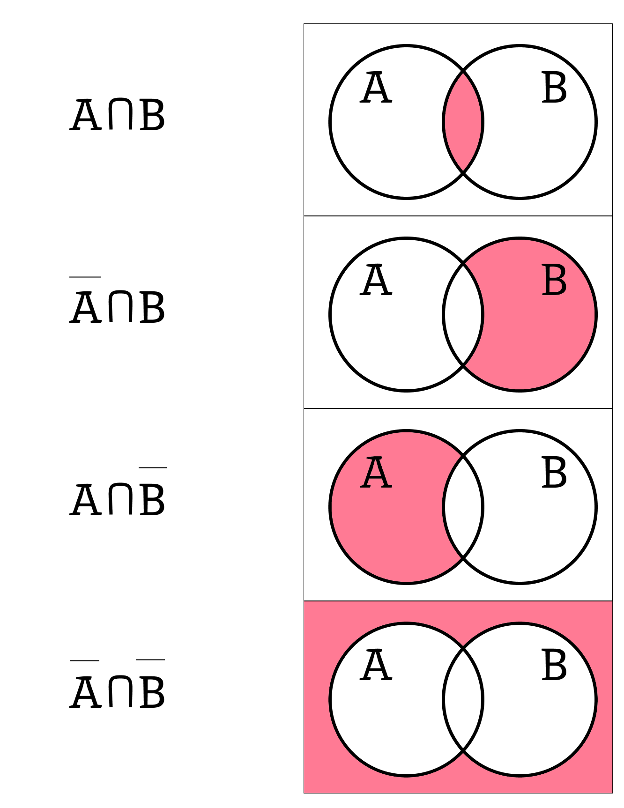

#Домашнее задание №3

## Задание 1
В некотором случайном опыте может произойти событие K. Найдите вероятность события K, если вероятность события K равна:
- а) 0,4; 
- б) 0,85; 
- в) 0,13; 
- г) 12; 
- д) p. Какие значения может принимать p?

Полагаю, что в тексте задания потерялся знак верхней черты над К и необходимо найти вероятность K¯ (не K), иначе оно не имеет смысла. Поэтому буду исходить из того, что необходимо найти вероятность K¯.
- а) При К = 0.4, вероятность события K¯ = 1 - 0.4 = **0.6**; 
- б) При К = 0.85, вероятность события K¯ = 1 - 0.85 = **0.15**; 
- в) При К = 0.13, вероятность события K¯ = 1 - 0.13 = **0.87**; 
- г) К не может принимать значение больше 1, поскольку вероятность - отношение благоприятных исходов к числу экспериментов. При К = 12, на один эксперимент должно приходится 12 удачных исходов, что **не имеет смысла**; 
- д) При К = p, вероятность события K¯ = **1 - p**. При этом p может принимать значения от 0 до 1.

## Задание 2
Бросают одну игральную кость. Событие A — «выпало четное число очков». Событие B состоит в том, что:
- а) выпало число очков, кратное 3;
- б) выпало нечетное число очков;
- в) выпало число очков, кратное 4;
- г) выпало число очков, кратное 5.
Выпишите все элементарные события, благоприятствующие событию A ∪ B. Найдите P(A∪B).

Элементарные события для события А: 2, 4, 6. Вероятность события А = 1/6 + 1/6 + 1/6 = 3/6 = 1/2.
- а) Элементарные события для события B: 3, 6; Элементарные события для события A ∪ B: **2, 3, 4, 6**. P(A∪B) = 4/6 = **2/3** 
- б) Элементарные события для события B: 1, 3, 5; Элементарные события для события A ∪ B: **1, 2, 3, 4, 5, 6**. P(A∪B) = 6/6 = **1** 
- в) Элементарные события для события B: 4; Элементарные события для события A ∪ B: **2, 4, 6**. P(A∪B) = 3/6 = **1/2** 
- г) Элементарные события для события B: 5; Элементарные события для события A ∪ B: **2, 4, 5, 6**. P(A∪B) = 4/6 = **2/3**.

## Задание 3
Изобразите на диаграмме Эйлера событие:
- а) A∩B; 
- б) A∩B; 
- в) A∩B; 
- г) A∩B.
Снова полагаю, что потерялись знаки верхней черты, поэтому будем считать, что в задании комбинации из A, B, A¯ и B¯.
- а) A∩B; 
- б) A¯∩B; 
- в) A∩B¯; 
- г) A¯∩B¯.

## Задание 4
Вероятность того, что по дороге из школы домой вы встретите черную кошку, равна 0,1. Вероятность того, что по дороге из школы домой вы встретите злую собаку, равна 0,4. Вероятность того, что вам встретятся и черная кошка, и злая собака, равна 0,04.
- а) Найдите вероятность того, что вам встретится хотя бы одно из этих животных.
- б) Найдите вероятность того, что вы не встретите ни черную кошку, ни злую собаку.
Обозначим вероятность втретить кошку как A, а злую собаку как B. Тогда
- a) Вероятность P(A+B) = P(A) + P(B) - P(AB) = 0.1 + 0.4 - 0.04 = **0.46**
- б) Вероятность того, что мы не встретим кошку: 1 - 0.1 = 0.9. Вероятность того, что не встретим собаку: 1 - 0.4 = 0.6. События независимы, поэтому P(AxB) = P(A) x P(B) = 0.9 * 0.6 = **0.54**.

## Задание 5
Бросают одну игральную кость. Событие A — «выпало четное число очков». Являются ли независимыми события A и B, если событие B состоит в том, что:
- а) выпало число очков, кратное 3;
- б) выпало число очков, кратное 5?

События будут являться независимыми, если вероятность их пересечения будет равна произведению их вероятностей. Элементарные события для А: 2, 4, 6. P(A) = 3/6 = 1/2. 
- а) Элементарные события для В: 3, 6. P(B) = 2/6 = 1/3. Элементарные события А∩В: 6, соответственно P(A∩B)= 1/6. P(A) * P(B) = 1/2 * 1/3 = **1/6**, следовательно P(A∩B) = P(A) * P(B), а значит события **А и В являются независимыми**.
- б) Элементарные события для В: 5. P(B) = 1/6. Элементарные событий для А∩В не существует (или пустое множество), соответственно P(A∩B) = 0. P(A) * P(B) = 1/2 * 1/6 = **1/12**, следовательно P(A∩B) ≠ P(A) * P(B), а значит события **А и В не являются независимыми**.